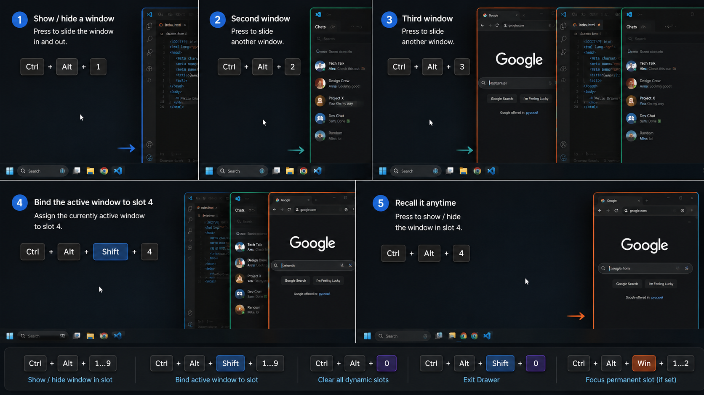
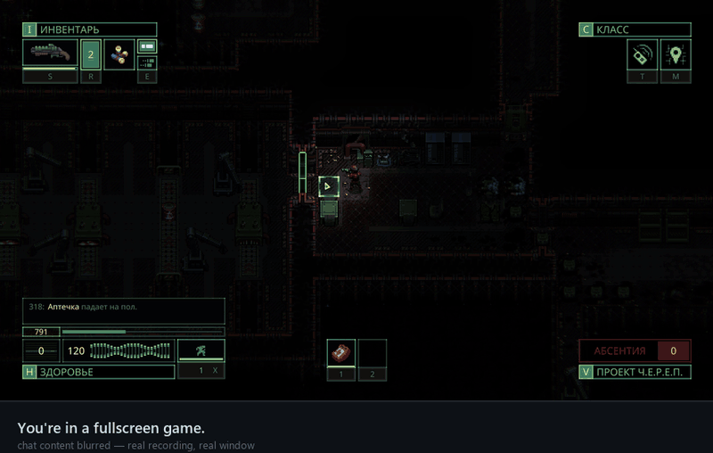

# Drawer

> Put your windows away. Bring them back instantly.

A lightweight Windows utility that lets you park any window off-screen
and bring it back instantly with a hotkey — like a drawer on your desk.





## Why Drawer?

- ⚡ Instant access with hotkeys
- 🎯 9 configurable slots
- 🔄 Permanent or dynamic window binding
- 🖥️ Multi-monitor support
- 👻 Works with Alt+Tab and the taskbar
- 🎨 Configurable drawer position, size and behavior
- 📦 Portable — no installation required

## Quick Start

1. Download `Drawer-v0.1.zip` from **Releases**.
2. Extract it anywhere.
3. Edit `config.ini` if you want to customize the default setup.
4. Run `Drawer.exe`.

That's it.

## Hotkeys

| Hotkey | Action |
|---|---|
| `Ctrl + Alt + 1…9` | Show / hide slot |
| `Ctrl + Alt + Shift + 1…9` | Bind the current window to a dynamic slot |
| `Ctrl + Alt + 0` | Clear all dynamic bindings |
| `Ctrl + Alt + Shift + 0` | Exit Drawer and restore all windows |

### How dynamic slots work

Press `Ctrl + Alt + Shift + N` while the window you want is active.

That exact window is now assigned to slot `N`.

For example:

```text
Ctrl + Alt + Shift + 4
        ↓
Google Chrome → Slot 4

Ctrl + Alt + 4
        ↓
Chrome slides in / out